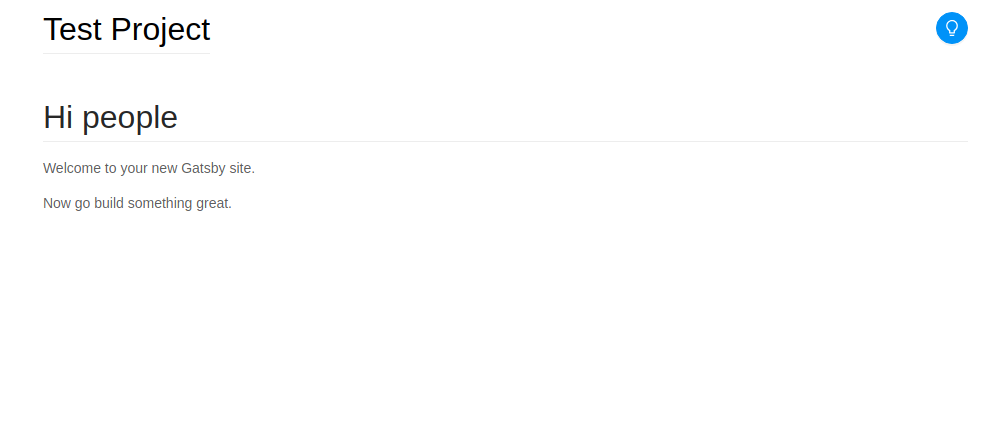

## AntDesign

AntDesign là một thư viện UI, gồm các UI component làm sẵn như Button, InputBox, ...
Để sử dụng AntD cho Gatsby, ta cài đặt:

```
yarn add antd gatsby-plugin-antd
```

Thêm `'gatsby-plugin-antd'` vào mục `plugins` ở file `gatsby-config.js`

Okay, hãy thêm vào file `component/header.js` một nút toggle để thay đổi giữa dark mode/light mode

```jsx
// component/header.js
const Header = ({ siteTitle }) => (
    <header className={style.header}>
        <div className={style.div}>
            <h1 className={style.h1}>
                <Link to="/" className={style.Link}>
                    {siteTitle}
                </Link>
            </h1>
            {/*Thêm dòng dưới đây*/}
            <Button
                className={style.button}
                icon="bulb"
                type="primary"
                shape="circle"
            />
        </div>
    </header>
)
```

```css
/*components/header.module.css*/
/*Sửa mục này*/
.h1 {
    /*Thêm dòng này*/
    display: inline-block;
    margin: 0;
}

/*Thêm mục này*/
.button {
    float: right;
}
```

Header page của bạn sẽ có một cái nút để đổi màu, kiểu như thế này.


## Viết logic cho phần đổi màu:

### React Context

Nếu ai đã làm việc với React thì sẽ biết rằng, để lưu một thông tin một cách thủ công, ví dụ như thông tin về theme hiện tại, ta phải truyền nó trên toàn bộ cây DOM. Tuy nhiên chỉ có một số thành phần lại cần đến thông tin này để render, các thành phần khác chỉ có nhiệm vụ truyền thông tin xuống.

Có hai cách để giải quyết:

-   Dùng Redux, toàn bộ thông tin lưu vào một store, các thành phần cần lấy thông tin sẽ hỏi store đó.
-   Dùng React.Context, đặt một ContextProvider ở trên đỉnh của cây DOM, các thành phần cần lấy thông tin sẽ dùng ContextConsumer để hỏi. Mình sẽ sử dụng cách này vì chỉ có thông tin theme là cần truyền khắp cây DOM thôi.

Tạo một file `context.js` với nội dung

```js
import React from "react"
const ThemeContext = React.createContext({
    theme: "dark",
    switchTheme: () => {
        console.log("default")
    },
})
class ThemeProvider extends React.Component {
    state = {
        theme: "dark",
    }
    switchTheme = () => {
        const theme = this.state.theme === "dark" ? "light" : "dark"
        localStorage.setItem("theme", theme)
        this.setState({ theme })
    }
    componentDidMount() {
        const theme = localStorage.getItem("theme") || "dark"
        this.setState({ theme })
    }
    render() {
        return (
            <ThemeContext.Provider
                value={{
                    theme: this.state.theme,
                    switchTheme: this.switchTheme
                }}
            >
                {this.props.children}
            </ThemeContext.Provider>
        )
    }
}

export default ThemeContext

export { ThemeProvider }
```

Sau đó, để register ContextProvider này, ta cần chỉnh sửa file `gatsby-browser.js`

```jsx
import React from "react"

import { ThemeProvider } from "./src/context"

export const wrapRootElement = ({ element }) => (
    <ThemeProvider>{element}</ThemeProvider>
)
```

Bây giờ bạn có thể access hai giá trị này ở `component/header.js`

Sửa file này như sau:

```jsx
import ThemeContext from "../context"
import { useContext } from "react"

const Header = ({ siteTitle }) => {
    const { theme, switchTheme } = useContext(ThemeContext)
    return (
        <header className={style.header}>
            <div className={style.div}>
                <h1 className={style.h1}>
                    <Link to="/" className={style.Link}>
                        {siteTitle + " " + theme}
                    </Link>
                </h1>
                <Button
                    className={style.button}
                    icon="bulb"
                    type="primary"
                    shape="circle"
                    onClick={switchTheme}
                />
            </div>
        </header>
    )
}
```

Bây giờ, nếu bạn bấm vào nút bấm ở Header, bạn sẽ thấy dòng chữ "dark" và "light" luân phiên thay đổi.


Trong [bài tiếp theo](/blog-guide-6), mình sẽ tìm cách để thông tin light và dark này thay đổi style của trang.
