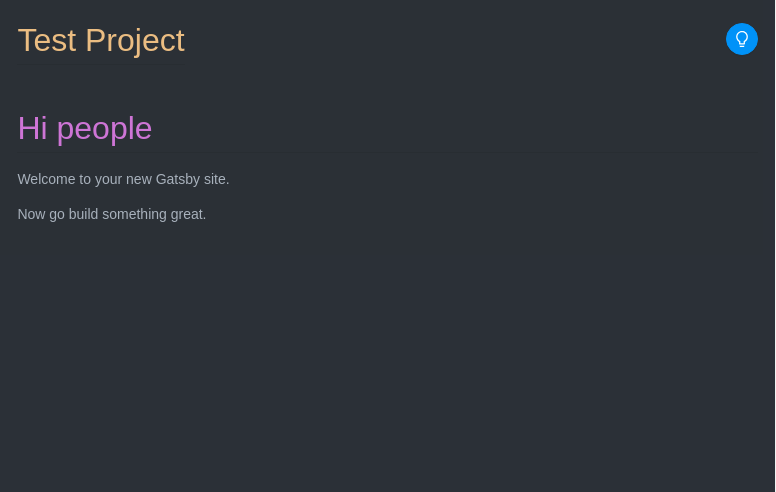
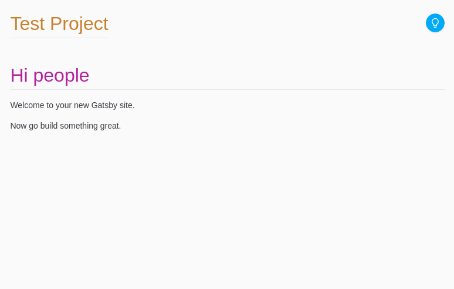

## Ý tưởng để thay đổi theme.
Khi thay đổi theme, ta sẽ thay đổi className của `<body>`. Ứng với mỗi class sẽ có setting màu riêng dành cho page.

Đầu tiên, thay đổi className của `<body>` như sau:

```js
// context.js
class ThemeProvider extends React.Component {
    switchTheme = () => {
        const theme = this.state.theme === "dark" ? "light" : "dark"
        localStorage.setItem("theme", theme)
        // Thêm dòng này
        document.body.className = theme
        this.setState({ theme })
    }
    componentDidMount() {
        const theme = localStorage.getItem("theme") || "dark"
        this.setState({ theme })
        // Thêm dòng này
        document.body.className = theme
    }
```
 
Bây giờ, nếu ta inspect element, ta sẽ thấy class của `<body>` thay đổi

## CSS-Variable
Tạo một file `theme.css` ở `components` và cho `layout.js` import nó. Điền vào file này đoạn code dưới đây.

```css
body.light {
    --primary: hsl(  5, 74%, 59%);
    --secondary: hsl(221, 87%, 60%);
    --bg: hsl(230, 1%, 98%);
    --textTitle: hsl(301, 63%, 40%);
    --textNormal: hsl(230, 8%, 24%);
    --header: hsl(230, 4%, 64%);
    --textLinkHover: hsl(41, 99%, 30%);
    --textLink: hsl(41, 99%, 38%);
    --hr: hsl(198, 99%, 37%);
}

body.dark {
    -webkit-font-smoothing: antialiased;
    --primary: hsl(355, 65%, 65%);
    --secondary: hsl(207, 82%, 66%);
    --bg: hsl(220, 13%, 18%);
    --textTitle: hsl(286, 60%, 67%);
    --textNormal: hsl(220, 14%, 71%);
    --header: hsl(220,  10%, 40%);
    --textLink: hsl( 39, 67%, 69%);
    --textLinkHover: hsl( 29, 54%, 61%);
    --hr: hsl(187, 47%, 55%);
}
h1 {
    color: var(--textTitle)
}
h2, h3, h4, h5, h6 {
    color: var(--header)
}
body {
    background: var(--bg)
}
a {
    color: var(--textLink)
}

a:hover {
    color: var(--textLinkHover)
}

p, div, span {
    color: var(--textNormal)
}
hr {
    color: var(--hr)
}
* {
    transition: color 0.5s ease-in-out, background-color 0.5s ease-in-out;
}
```

Các mục có dạng `--*` gọi là CSS variables. Những mục này không có ảnh hưởng đến style, nhưng giá trị của nó có thể được sử dụng lại cho các mục khác bằng cách gọi `var(tên)` giống như trên.

Bây giờ, bạn có thể bấm vào nút bấm hình bóng đèn và thấy theme của bạn được thay đổi giữa dark mode và light mode, như thế này:



Okay, mình sẽ tìm cách để Gatsby load các bài blog trong [bài viết sau](/blog-guide-7).
