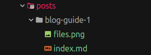

## Slug Field?

Slug field là một cách để tạo ra url cho một bài blog bất kỳ. Ví dụ: bài blog demo chúng ta làm trong bài trước có thể sẽ được đặt tại `http://tên-miền-blog.com/demo`.

Cách chúng ta sinh slug field rất đơn giản. Với tất cả các file Markdown nằm trong thư mục `posts`, chúng ta sẽ thu gọn đường dẫn của nó tính từ gốc là `posts`. Ví dụ với file như sau:



slug field của bài blog này sẽ là `/blog-guide-1/`. Rất đơn giản

Để tạo slug field, ta viết đoạn code sau vào file `gatsby-node.js`

```js
const { createFilePath } = require(`gatsby-source-filesystem`)

exports.onCreateNode = ({ node, getNode, actions }) => {
    const { createNodeField } = actions
    if (node.internal.type === `MarkdownRemark`) {
        const slug = createFilePath({ node, getNode, basePath: `posts` })
        createNodeField({
            node,
            name: `slug`,
            value: slug,
        })
    }
}
```

## Page?

Các bài blog đã được load vào và có thể truy vấn được, nhưng để xem được nó chúng ta phải tạo ra các page từ bài blog đó.

Các bài blog đều có chung một bố cục, chỉ khác nhau về nội dung. Vì vậy chúng ta có thể tạo cho nó một mẫu (template) và tự động điền các thông tin của bài blog vào các vị trí thích hợp trong mỗi trang.
Tạo một thư mục ở trong `src` có tên là `templates`. Tạo trong đó một file `blog-post.js` với nội dung như sau:

```jsx
import React from "react"
import Layout from "../components/layout"
import { graphql } from "gatsby"
import SEO from "../components/seo"

export default function Template({ data }) {
    const { markdownRemark: post } = data
    const time = new Date(post.frontmatter.date)
    return (
        <>
            <Layout>
                <SEO title={post.frontmatter.title} />
                <i>{time.toDateString()}</i>
                <div dangerouslySetInnerHTML={{ __html: post.html }} />
            </Layout>
        </>
    )
}
export const query = graphql`
    query($path: String!) {
        markdownRemark(fields: { slug: { eq: $path } }) {
            html
            frontmatter {
                date
                title
            }
            fields {
                slug
            }
        }
    }
`
```

Bây giờ chúng ta sẽ tạo các page với template này. Điền đoạn code sau vào file `gatsby-node.js`

```js
const path = require("path")
exports.createPages = ({ boundActionCreators, graphql }) => {
    const { createPage } = boundActionCreators
    const blogPostTemplate = path.resolve(`src/templates/blog-post.js`)
    return graphql(`
        {
            allMarkdownRemark(
                sort: { order: DESC, fields: [frontmatter___date] }
                limit: 1000
            ) {
                edges {
                    node {
                        excerpt(pruneLength: 250)
                        html
                        id
                        frontmatter {
                            date
                            title
                        }
                        fields {
                            slug
                        }
                    }
                }
            }
        }
    `).then(result => {
        if (result["errors"]) {
            return Promise.reject(result["errors"])
        }
        result.data["allMarkdownRemark"]["edges"].forEach(({ node }) => {
            createPage({
                path: node.fields["slug"],
                component: blogPostTemplate,
            })
        })
    })
}
```

Bạn có thể cần restart lại `gatsby develop` để nó có hiệu lực.
Nếu bây giờ bạn đến địa chỉ `localhost:8000/demo`, bạn sẽ đọc được bài blog của mình.

Trong [bài tiếp theo](/blog-guide-9) mình sẽ hướng dẫn bạn tạo danh sách bài viết ở trang chủ.
